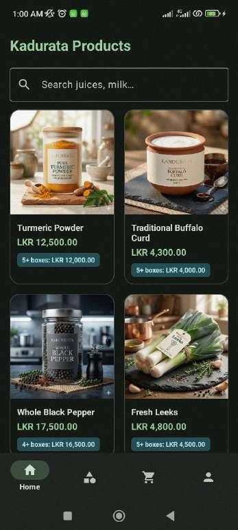
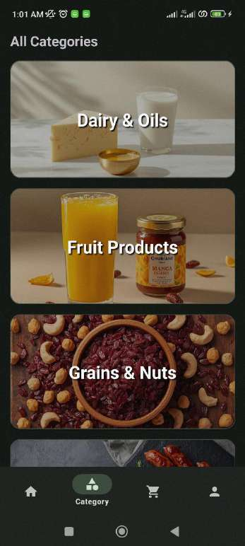
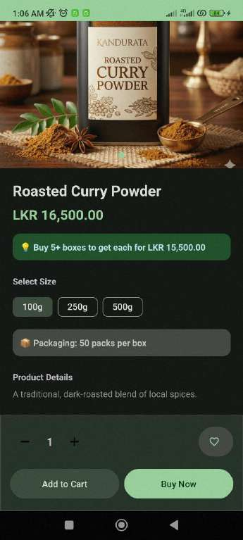
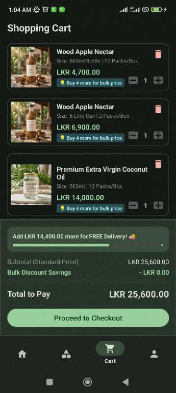
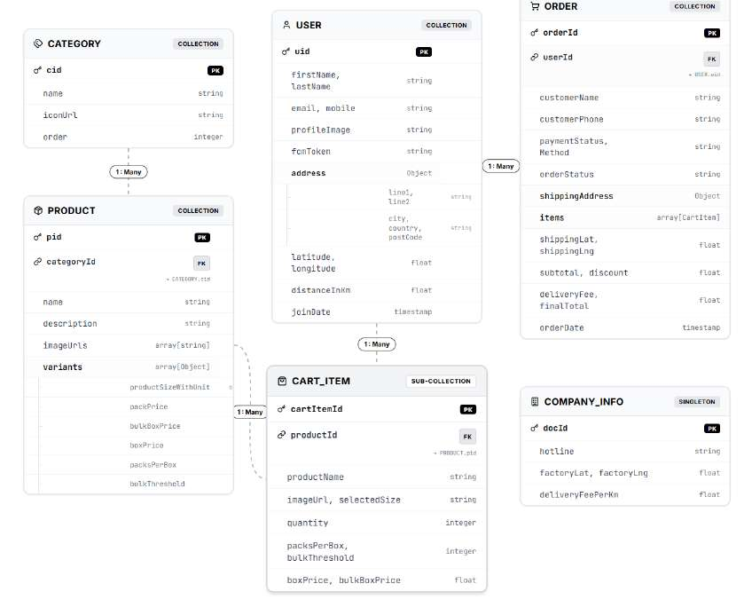
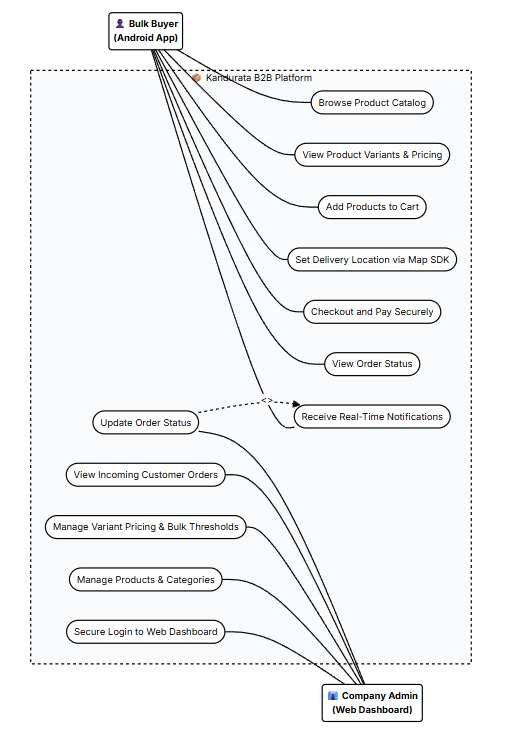
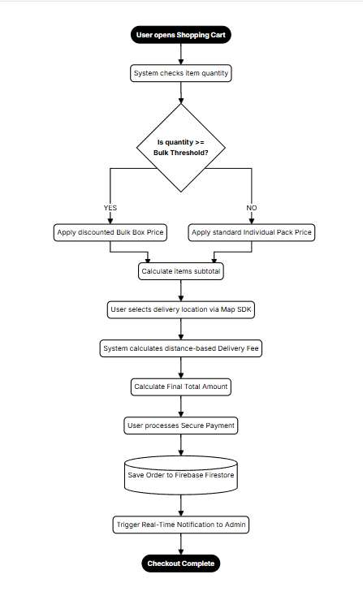

<div align="center">

# 🌿 Kandurata
### B2B Wholesale Ordering Platform for a Sri Lankan Production Company

A native Android app for bulk buyers + a Firebase-powered backend that replaces phone-call ordering with 24/7 self-service purchasing, automated bulk pricing, live GPS-based delivery fees, and real-time order tracking.


</div>

---

## 📖 About the Project

**Kandurata** is a final-year BSc (Hons) Software Engineering project built for a real, growing Sri Lankan production company that manufactures and sells goods in bulk to other businesses. Before this system existed, every order went through phone calls and in-person meetings — slow, error-prone, and impossible to scale as the company started exporting overseas.

This project digitizes that entire sales pipeline with:

- 📱 A **native Android app** where registered wholesale buyers browse the catalog, select product variants, get automatic bulk pricing, pin a delivery location on a map, and pay securely — any time, from any time zone.
- 🖥️ A **Web Admin Dashboard** where the company manages products, pricing rules, and incoming orders in real time.
- ☁️ A shared **Firebase backend** (Firestore + Cloud Functions + Cloud Messaging) that keeps both sides perfectly in sync.

> **Repo scope:** this repository contains the **Android client** and the **Firebase Cloud Functions backend**. The Web Admin Dashboard is a separate HTML/Tailwind CSS/JavaScript front-end that connects to the same Firebase project.

---

## 🚩 The Problem

The company's manual ordering process created real operational pain:

| Problem | Impact |
|---|---|
| High labor cost | Staff needed just to answer calls and write down orders |
| Human error | Mistakes in quantities, pricing, and delivery details |
| No 24/7 access | Buyers (especially overseas ones in other time zones) could only order during office hours |
| Poor product visibility | No way to browse products without a sales rep or printed catalog |
| Manual accounting | Payments tracked by hand, slow and error-prone |
| Slow, disconnected fulfillment | Production team had no clear, live view of what to manufacture |

---

## ✨ Key Features

### 🛒 For Bulk Buyers (Android App)
- **24/7 catalog access** across all product categories, no sales rep required
- **Variant selection** — choose specific sizes/weights per product
- **Automated bulk pricing** — pricing automatically switches from per-pack price to a discounted bulk-box price once a quantity threshold is crossed
- **Cart & checkout** with live subtotal, discount, and delivery fee breakdown
- **Google Maps delivery picker** — pin the exact drop-off location instead of typing an address
- **Distance-based delivery fee**, calculated automatically from the factory location to the pinned delivery point
- **Secure in-app payments** via the PayHere payment gateway
- **Real-time order tracking** with push notifications the moment the admin updates an order's status
- **Order history & invoices**, wishlist, editable profile & billing address
- Email/password sign-in with a custom verification-code flow, Google Sign-In, and code-based password reset
- **Light/dark theme support** and a one-tap hotline call button

### 🖥️ For Administrators (Web Dashboard)
- Secure admin login
- **Product & category management** — add products, update images and prices
- **Complex pricing control** — configure per-pack price, bulk box price, pack-per-box counts, and bulk quantity thresholds per product variant
- **Live order feed** — every order placed on the app appears instantly so production knows exactly what to manufacture
- **Automated accounting** — payments and order status tracked centrally, no manual bookkeeping

---

## 📸 Screenshots

<table>
<tr>
<td align="center"><br/><sub><b>Home / Catalog</b></sub></td>
<td align="center"><br/><sub><b>Categories</b></sub></td>
<td align="center"><br/><sub><b>Product Detail & Variants</b></sub></td>
<td align="center"><br/><sub><b>Cart & Bulk Pricing</b></sub></td>
</tr>
</table>

---

## 🏗️ System Architecture

The Android app follows an **MVVM (Model-View-ViewModel) + Repository** architecture on top of a Firebase backend:

```
Android App (Java, MVVM)                Firebase Backend
┌───────────────────────┐               ┌───────────────────────────┐
│ Views                 │               │ Firestore (NoSQL)         │
│  Activities/Fragments │  ViewModel    │  users / products /       │
│  Adapters             │◄────────────► │  categories / orders /    │
├───────────────────────┤   LiveData    │  companyInfo              │
│ ViewModels             │              ├───────────────────────────┤
├───────────────────────┤               │ Firebase Authentication    │
│ Repositories           │   Firestore  │  (Email/Password, Google)  │
│  Auth/Product/Order/    │◄───────────►├───────────────────────────┤
│  Cart/User/Wishlist    │   Cloud SDK  │ Cloud Functions (Node.js)  │
├───────────────────────┤               │  order status → push      │
│ FirestoreExecutor       │              │  email verification codes │
│  (background thread     │              │  password reset codes     │
│   pool + callbacks)      │             ├───────────────────────────┤
└───────────────────────┘               │ Cloud Messaging (FCM)      │
                                          │ Cloud Storage (images)    │
                                          └───────────────────────────┘
                                                     ▲
                                                     │ same project
                                          ┌───────────────────────────┐
                                          │ Web Admin Dashboard        │
                                          │ (HTML/CSS/JS + Tailwind)   │
                                          └───────────────────────────┘
```

Because the mobile app and the web dashboard both read and write the **same Firestore collections**, an order placed on the app appears on the admin dashboard instantly, and an order-status update on the dashboard triggers a Cloud Function that pushes a notification straight back to the buyer's phone.

---

## 🧰 Tech Stack

| Layer | Technology |
|---|---|
| Mobile client | Java, Android SDK (min 24 / target & compile 36), ViewBinding, Jetpack Navigation Component |
| Architecture | MVVM + Repository pattern, custom `DataCallback` async interface |
| Database | Firebase Firestore (NoSQL, real-time sync) |
| Auth | Firebase Authentication (Email/Password + Google Sign-In) with custom email-verification & password-reset codes |
| Backend logic | Firebase Cloud Functions (Node.js, `firebase-functions`) |
| Notifications | Firebase Cloud Messaging (FCM) |
| Email delivery | Nodemailer via Gmail SMTP (Cloud Functions) |
| File storage | Firebase Cloud Storage |
| Maps & location | Google Maps SDK for Android, Play Services Location, Android Maps Utils |
| Payments | PayHere Android SDK |
| Image loading | Glide (with a custom `AppGlideModule`) |
| Networking / utils | OkHttp, Gson, Lombok |
| UI | Material Components, ConstraintLayout, DotsIndicator (image carousels) |
| Admin dashboard | HTML, CSS, JavaScript, Tailwind CSS *(separate front-end, same Firebase project)* |

---

## 🗄️ Data Model (Firestore Schema)



| Collection | Purpose |
|---|---|
| **CATEGORY** | Product categories shown on the home screen (`cid`, `name`, `iconUrl`, display `order`) |
| **PRODUCT** | Product catalog, linked to a category, with an array of size/weight `variants`, each carrying its own pack price, bulk box price, packs-per-box count, and bulk quantity threshold |
| **USER** | Buyer profile — contact details, saved address, geo-coordinates, distance to factory, FCM token for push notifications |
| **USER → CART_ITEM** (sub-collection) | The buyer's active cart, storing a denormalized snapshot of product/pricing data for fast reads |
| **ORDER** | A placed order — customer info, payment status/method, order status, shipping address & coordinates, line items, subtotal, discount, delivery fee, final total |
| **COMPANY_INFO** (singleton) | Business config: hotline number, factory coordinates, and the per-km delivery fee rate used in the distance calculation |

---

## 🔄 Core Flows

### Use Case Overview


### Checkout, Bulk Pricing & Delivery Fee Logic


When a buyer checks out, the system:
1. Checks the item quantity against that variant's **bulk threshold**
2. Applies either the standard **pack price** or the discounted **bulk box price**
3. Reads the buyer's pinned map location and the factory's stored coordinates to calculate a **distance-based delivery fee**
4. Computes the final total, processes payment through **PayHere**, saves the order to Firestore, and triggers a real-time notification to the admin dashboard

---

## ⚙️ Engineering Highlights

These are the parts of the build that went beyond "connect a UI to a database":

- **Custom `FirestoreExecutor`** — a dedicated background executor that wraps every Firestore call, catches unexpected errors, and reports back through a callback rather than letting anything crash the main thread.
- **`DataCallback` interface** — a consistent success/error contract used across every repository (`Auth`, `Product`, `Order`, `Cart`, `User`, `Wishlist`) so async Firebase calls resolve cleanly and predictably.
- **Global loading state** — a shared `LoadingDialog` triggered automatically around async operations so the user always sees feedback instead of a frozen screen.
- **Splash-time preloading (`SplashRepository`)** — categories and products are fetched in the background while the splash screen is showing, so the home screen never renders empty.
- **Server-side push trigger** — a Firestore `onUpdate` Cloud Function (`notifyOrderStatusChange`) watches the `orders` collection; the moment `orderStatus` changes, it looks up the buyer's FCM token and sends a push notification automatically — no polling on the client.
- **Custom auth flows** — registration and password reset use one-time codes generated and emailed by Cloud Functions (via Nodemailer), instead of relying solely on Firebase's default email templates.
- **Ambient theme switching (`ThemeManager`)** — the app adapts between light and dark themes based on the device's ambient light sensor, in addition to the standard system dark-mode support.

---

## 📂 Project Structure (High-Level)

```
kandurata/
├── app/src/main/java/com/maulaushianadikram/kandurata/
│   ├── data/
│   │   ├── model/         → Category, Product, User, Order, CompanyInfo
│   │   ├── repository/    → Auth, Cart, Order, Product, Splash, User, Wishlist repositories
│   │   ├── listeners/     → DataCallback (async success/error contract)
│   │   └── exception/     → DataException
│   ├── viewmodels/        → Account, Auth, Cart, Home, Splash, Wishlist ViewModels
│   ├── views/
│   │   ├── activities/    → Sign In/Up, Checkout, Billing, Invoice, Order History,
│   │   │                    Product Detail, Shipping Map, Settings, Wishlist, etc.
│   │   ├── fragments/     → Home, Category, Cart, Account, LoadingDialog
│   │   └── adapters/      → Product, Category, Cart, Checkout, Orders, Image Pager
│   ├── services/          → MyFirebaseMessagingService (FCM)
│   └── util/              → FirestoreExecutor, SessionManager, ThemeManager, Validator
└── functions/              → Firebase Cloud Functions (Node.js)
    ├── notifyOrderStatusChange
    ├── sendRegistrationEmailCode / verifyRegistrationEmail
    └── requestPasswordResetCode / resetPasswordWithCode
```

*(This is a structural overview for documentation purposes — source code is not included in this write-up.)*

---

## 🧪 Testing & Results

The system was validated with a focused round of functional testing:

- **Pricing & bulk-threshold testing** — verified cart totals recalculate correctly as quantities cross bulk thresholds
- **Location & delivery-fee testing** — pinned multiple delivery points on the map and confirmed delivery fees scaled correctly with distance
- **Background/performance testing** — ran the app on slow connections to confirm the loading system and `FirestoreExecutor` kept the UI responsive under load
- **Cross-platform sync testing** — placed orders on the Android app and confirmed they appeared instantly on the admin dashboard, with status updates flowing back to the app as push notifications

Remaining work before a public production release includes payment-gateway security testing and load testing for concurrent order spikes.

---

## 🔭 Future Work

- 🌐 Multi-language support (Sinhala & Tamil)
- 💬 In-app live chat between buyers and admin
- 🍎 iOS version of the buyer app

---

## 🎓 Project Context

This project was built as the final assessment for **JIAT/HHDPII — Handheld Device Programming II**, part of the **BSc (Hons) in Software Engineering** programme at the **Java Institute for Advanced Technology**, affiliated with **Birmingham City University**.

**Author:** Isuru Priyamantha
